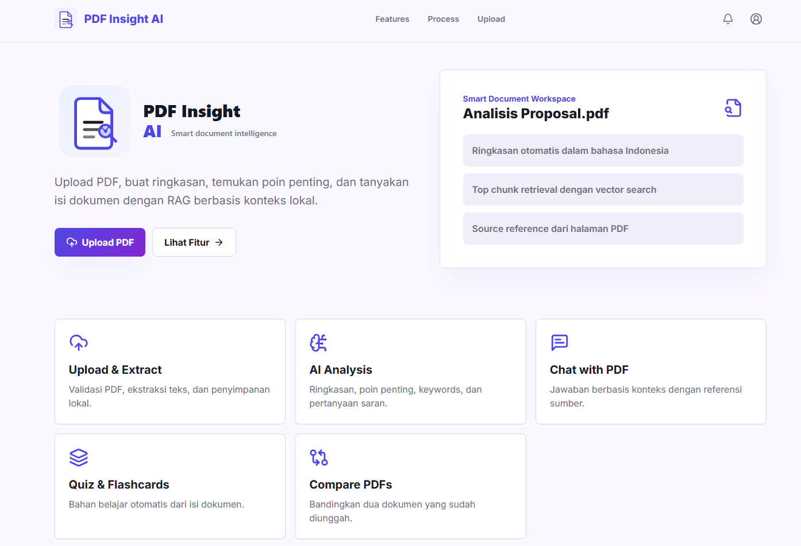
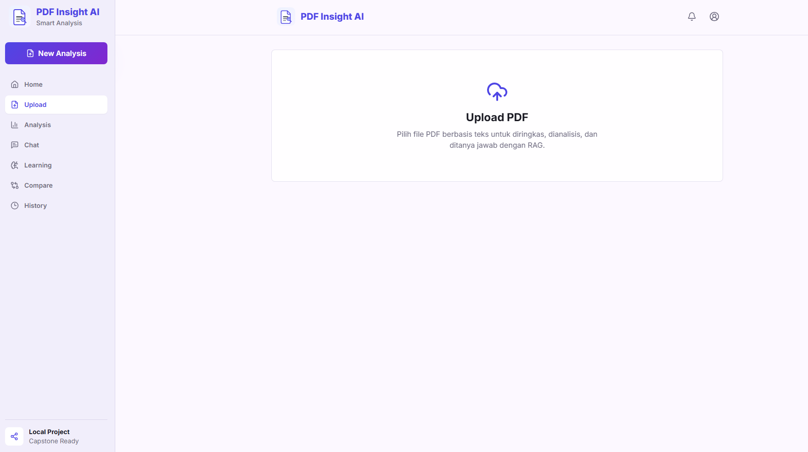
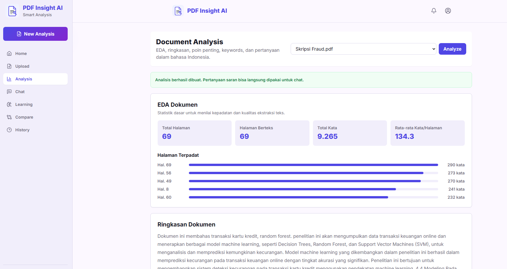
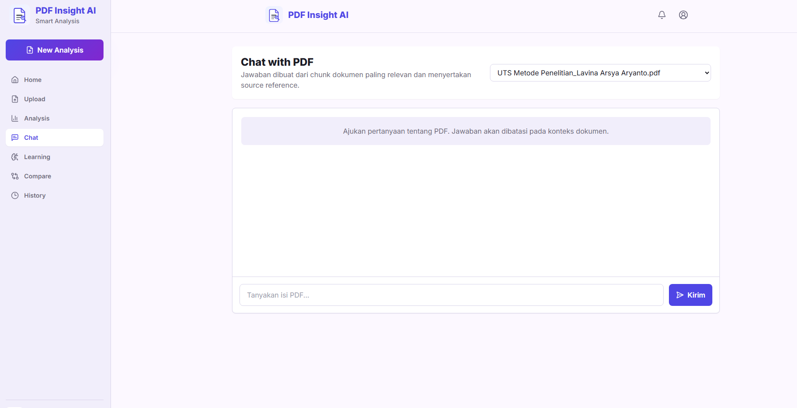
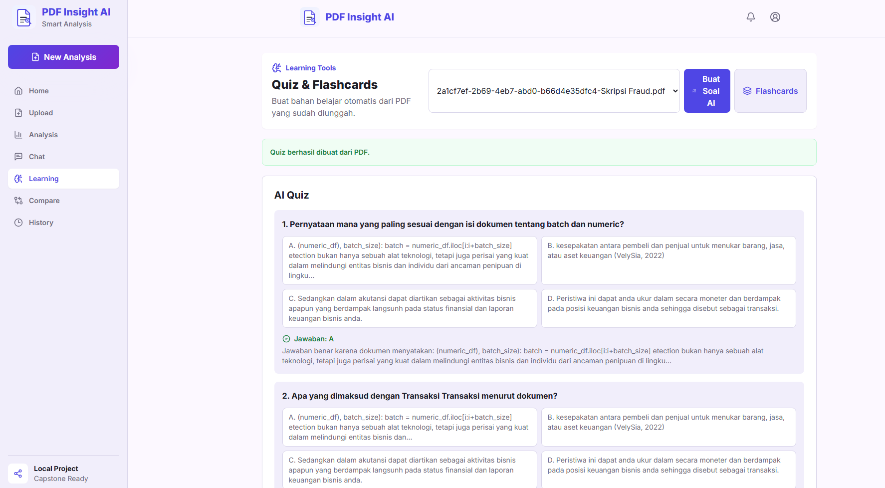
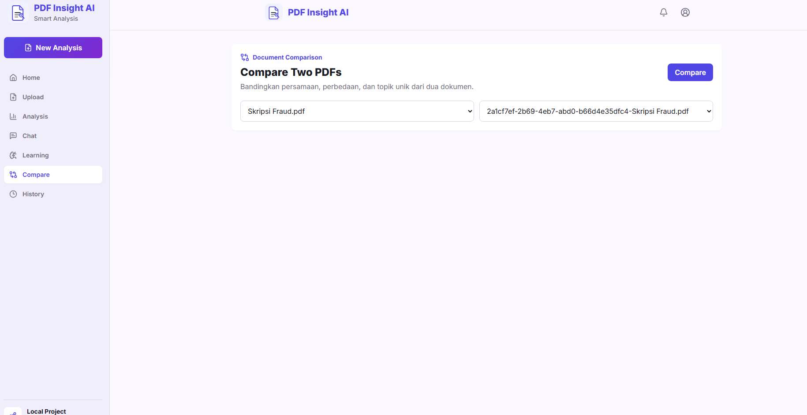
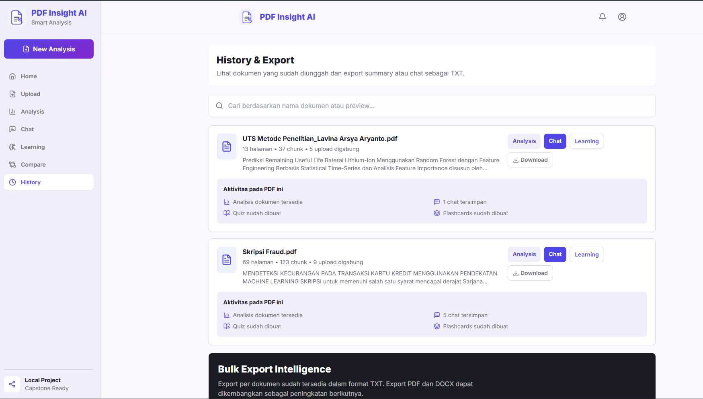

# PDF Insight AI

**PDF Insight AI** adalah aplikasi web full-stack berbasis AI untuk membantu pengguna memahami isi dokumen PDF lebih cepat. Pengguna dapat mengunggah PDF, mengekstrak teks, membuat ringkasan, mengambil poin penting, membuat quiz dan flashcards, membandingkan dua dokumen, serta melakukan chat dengan PDF menggunakan pendekatan Retrieval-Augmented Generation (RAG).

Project ini dirancang sebagai **student capstone project** atau **portfolio project** yang berjalan secara lokal tanpa database berbayar.

## Fitur Utama

- Upload file PDF berbasis teks dengan validasi format dan kualitas teks.
- Preview PDF langsung di halaman chat.
- Clickable source references untuk membuka halaman PDF terkait.
- Confidence score dan confidence label pada setiap source reference.
- RAG retrieval details untuk menjelaskan chunk yang dipakai sebagai konteks AI.
- Document quality checker untuk mendeteksi kualitas teks dan kemungkinan PDF scan.
- Export full analysis report ke PDF dan DOCX.
- Ekstraksi teks dari PDF berbasis teks.
- Pemecahan teks menjadi chunk untuk kebutuhan RAG.
- Embedding lokal untuk pencarian konteks dokumen.
- Vector search lokal menggunakan ChromaDB jika tersedia, dengan fallback JSON vector store.
- Analisis dokumen dalam bahasa Indonesia:
  - Ringkasan
  - Poin penting
  - Keywords
  - Suggested questions
- Chat dengan PDF berdasarkan konteks dokumen.
- Source reference pada jawaban chat:
  - Nomor halaman
  - Cuplikan teks relevan
- Quiz generation dari isi PDF.
- Flashcard generation dari isi PDF.
- Perbandingan dua dokumen PDF.
- History dokumen dan chat per dokumen.
- Search dokumen di halaman history.
- Hapus dokumen beserta chat, file export, dan vector chunks terkait.
- Export aktivitas dokumen ke format TXT, PDF, dan DOCX.
- UI responsif untuk desktop dan mobile.

## Tech Stack

**Frontend**

- React
- Vite
- Tailwind CSS
- Axios
- React Router
- Lucide React

**Backend**

- Python
- FastAPI
- Uvicorn
- pdfplumber
- sentence-transformers
- ChromaDB opsional
- Groq API
- python-dotenv
- reportlab
- python-docx

**Local Storage**

- Upload PDF: `backend/uploads`
- Data dokumen dan chat: `backend/data`
- Vector store lokal: `backend/vector_store`
- Export TXT/PDF/DOCX: `backend/exports`

## Arsitektur Sistem

```text
User
  |
  v
React + Vite Frontend
  |
  | REST API via Axios
  v
FastAPI Backend
  |
  |-- PDF Upload & Validation
  |-- PDF Text Extraction
  |-- Text Chunking
  |-- Local Embedding
  |-- Vector Search
  |-- Groq LLM Response
  |-- Local JSON History
  |-- Document Cleanup
  |-- TXT/PDF/DOCX Export
```

Alur RAG:

```text
Upload PDF
  -> Extract Text
  -> Split into Chunks
  -> Generate Embeddings
  -> Store Locally
  -> User Question
  -> Retrieve Relevant Chunks
  -> Send Context to Groq
  -> Return Answer + Sources
```

## Struktur Folder

```text
pdf-insight-ai/
  backend/
    main.py
    requirements.txt
    .env.example
    routers/
      upload.py
      analysis.py
      chat.py
      documents.py
      export.py
      learning.py
    services/
      pdf_service.py
      chunk_service.py
      embedding_service.py
      vector_service.py
      groq_service.py
      analysis_service.py
      learning_service.py
      export_service.py
      storage_service.py
    uploads/
    exports/
    vector_store/
    data/

  frontend/
    package.json
    index.html
    vite.config.js
    tailwind.config.js
    postcss.config.js
    src/
      api/
      components/
      pages/
      styles/

  README.md
```

## Setup Backend

> Prasyarat: install Python 3.10+ terlebih dahulu. Jalankan perintah berikut dari root project `pdf-insight-ai`.

1. Masuk ke folder backend:

```bash
cd backend
```

2. Buat virtual environment:

```bash
python -m venv .venv
```

3. Aktifkan virtual environment.

Windows PowerShell / Command Prompt:

```bash
.venv\Scripts\activate
```

macOS / Linux:

```bash
source .venv/bin/activate
```

4. Install dependency backend:

```bash
pip install -r requirements.txt
```
Dependency tambahan untuk export full report:

```bash
pip install reportlab python-docx
```

Dependency ini juga sudah tercantum di `backend/requirements.txt`.


5. Salin file environment.

Windows:

```bash
copy .env.example .env
```

macOS / Linux:

```bash
cp .env.example .env
```

6. Jalankan backend:

```bash
uvicorn main:app --reload
```


Backend akan berjalan di:

```text
http://localhost:8000
```

Dokumentasi API otomatis tersedia di:

```text
http://localhost:8000/docs
```

## Setup Frontend

> Prasyarat: install Node.js LTS terlebih dahulu. Jalankan terminal baru dari root project `pdf-insight-ai`.

1. Masuk ke folder frontend:

```bash
cd frontend
```

2. Install dependency frontend:

```bash
npm install
```

3. Jalankan frontend:

```bash
npm run dev
```

Frontend akan berjalan di:

```text
http://localhost:5173
```

Jika backend berjalan di URL berbeda, buat file `frontend/.env` dan isi:

```env
VITE_API_BASE_URL=http://localhost:8000
```

## Environment Variables

File environment backend berada di:

```text
backend/.env
```

Contoh isi:

```env
GROQ_API_KEY=your_groq_api_key_here
GROQ_MODEL=llama-3.1-8b-instant
FRONTEND_URL=http://localhost:5173,http://127.0.0.1:5173
USE_SENTENCE_TRANSFORMERS=false
```

Penjelasan:

- `GROQ_API_KEY`: API key dari Groq untuk menghasilkan jawaban AI.
- `GROQ_MODEL`: Model Groq yang digunakan.
- `FRONTEND_URL`: Origin frontend yang diizinkan oleh CORS.
- `USE_SENTENCE_TRANSFORMERS`: Jika `false`, aplikasi memakai embedding lokal deterministik tanpa download model. Jika `true`, aplikasi mencoba memakai model `sentence-transformers/all-MiniLM-L6-v2` dari cache lokal.

Jika frontend perlu diarahkan ke backend lain, buat file:

```text
frontend/.env
```

Isi:

```env
VITE_API_BASE_URL=http://localhost:8000
```

## Cara Mendapatkan Groq API Key

1. Buka situs Groq Console:

```text
https://console.groq.com/
```

2. Login atau buat akun Groq.
3. Masuk ke menu API Keys.
4. Buat API key baru.
5. Salin API key tersebut.
6. Tempelkan ke file `backend/.env`:

```env
GROQ_API_KEY=gsk_your_api_key_here
```

7. Jalankan ulang backend setelah mengubah `.env`.

Jika `GROQ_API_KEY` belum diisi, aplikasi tetap bisa diuji dalam mode lokal sederhana, tetapi jawaban AI tidak akan sebaik mode Groq aktif.

## Menjalankan Aplikasi Lokal

Buka terminal pertama untuk backend:

```bash
cd backend
.venv\Scripts\activate
uvicorn main:app --reload
```

Buka terminal kedua untuk frontend:

```bash
cd frontend
npm run dev
```

Buka aplikasi di browser:

```text
http://localhost:5173
```


## Demo Flow

Gunakan alur berikut untuk mendemokan **PDF Insight AI** dari awal sampai akhir:

1. Jalankan backend dengan `uvicorn main:app --reload`.
2. Jalankan frontend dengan `npm run dev`.
3. Buka `http://localhost:5173` di browser.
4. Masuk ke halaman `Upload`, lalu unggah PDF berbasis teks dengan ukuran maksimal 10 MB.
5. Buka halaman `Analysis`, pilih dokumen, lalu klik `Analyze` untuk membuat ringkasan, poin penting, keywords, dan pertanyaan saran.
6. Buka halaman `Chat`, pilih dokumen yang sama, lalu ajukan pertanyaan tentang isi PDF. Gunakan source reference untuk membuka halaman PDF yang relevan.
7. Buka halaman `Learning` untuk membuat quiz dan flashcards dari dokumen.
8. Upload minimal dua PDF, lalu buka halaman `Compare` untuk membandingkan dokumen.
9. Buka halaman `History` untuk melihat aktivitas per dokumen dan mengunduh hasil dalam format TXT, PDF, Word, Full Report PDF, atau Full Report DOCX.


## Cara Upload dan Test PDF

1. Jalankan backend dan frontend.
2. Buka halaman `Upload`.
3. Pilih file PDF.
4. Pastikan file adalah PDF berbasis teks, bukan hasil scan gambar murni.
5. Setelah upload berhasil, aplikasi akan menampilkan informasi dokumen.
6. Buka halaman `Analysis`, pilih dokumen, lalu klik `Analyze`.
7. Buka halaman `Chat`, pilih dokumen, lalu ajukan pertanyaan.
8. Cek source reference di bawah jawaban.
9. Buka halaman `Learning` untuk membuat quiz dan flashcards.
10. Upload minimal dua PDF, lalu buka halaman `Compare` untuk membandingkan dokumen.
11. Buka halaman `History` untuk mencari dokumen dan export hasil aktivitas dalam format TXT, PDF, atau Word.

## Dokumentasi API

### Health Check

```http
GET /
```

Response:

```json
{
  "message": "PDF Insight AI API is running"
}
```

### Upload PDF

```http
POST /upload
```

Input:

- `file`: PDF file

Response:

```json
{
  "document_id": "uuid",
  "file_name": "document.pdf",
  "total_pages": 10,
  "text_preview": "Preview teks...",
  "message": "PDF berhasil diunggah dan diproses."
}
```

### Analyze Document

```http
POST /analyze
```

Body:

```json
{
  "document_id": "uuid"
}
```

Response:

```json
{
  "summary": "Ringkasan dokumen...",
  "key_points": ["Poin 1", "Poin 2"],
  "keywords": ["keyword"],
  "suggested_questions": ["Pertanyaan?"]
}
```

### Chat With PDF

```http
POST /chat
```

Body:

```json
{
  "document_id": "uuid",
  "question": "Apa isi utama dokumen ini?"
}
```

Response:

```json
{
  "answer": "Jawaban berdasarkan konteks dokumen.",
  "sources": [
    {
      "page_number": 1,
      "snippet": "Cuplikan teks relevan sampai sekitar 300 karakter...",
      "score": 0.82
    }
  ]
}
```

### Generate Quiz

```http
POST /quiz
```

Body:

```json
{
  "document_id": "uuid",
  "total_questions": 5
}
```

Response:

```json
{
  "document_id": "uuid",
  "file_name": "document.pdf",
  "quiz": [
    {
      "question": "Pertanyaan kuis",
      "options": ["A", "B", "C", "D"],
      "answer": "A",
      "explanation": "Penjelasan singkat"
    }
  ],
  "raw": "Output AI mentah"
}
```

### Generate Flashcards

```http
POST /flashcards
```

Body:

```json
{
  "document_id": "uuid",
  "total_cards": 8
}
```

Response:

```json
{
  "document_id": "uuid",
  "file_name": "document.pdf",
  "flashcards": [
    {
      "front": "Istilah",
      "back": "Penjelasan"
    }
  ],
  "raw": "Output AI mentah"
}
```

### Compare Documents

```http
POST /compare
```

Body:

```json
{
  "first_document_id": "uuid-1",
  "second_document_id": "uuid-2"
}
```

Response:

```json
{
  "first_file_name": "document-a.pdf",
  "second_file_name": "document-b.pdf",
  "summary": "Hasil perbandingan...",
  "similarities": ["keyword"],
  "first_unique_keywords": ["keyword"],
  "second_unique_keywords": ["keyword"]
}
```

### Get Documents

```http
GET /documents
```

Search:

```http
GET /documents?q=keyword
```

Response:

```json
{
  "documents": []
}
```

### Get Document Detail

```http
GET /documents/{document_id}
```

Response berisi detail dokumen dan `chat_history`.

### Preview PDF File

```http
GET /documents/{document_id}/file
```

Mengembalikan file PDF yang sudah diunggah secara aman untuk kebutuhan preview di browser.

### Export Summary

```http
GET /export-summary/{document_id}
```

Mengunduh ringkasan dokumen dalam format TXT.

### Export Chat

```http
GET /export-chat/{document_id}
```

Mengunduh history chat dokumen dalam format TXT.

### Export Document Activity

```http
GET /export-document/{document_id}?section=all&format=pdf
```

Pilihan `section`: `all`, `summary`, `chat`, `quiz`, `flashcards`.

Pilihan `format`: `txt`, `pdf`, `docx`.

Mengunduh aktivitas yang pernah dilakukan pada dokumen dalam format yang dipilih.

### Export Full Report PDF

```http
GET /export-report-pdf/{document_id}
```

Mengunduh laporan lengkap analisis dokumen dalam format PDF.

### Export Full Report DOCX

```http
GET /export-report-docx/{document_id}
```

Mengunduh laporan lengkap analisis dokumen dalam format Word/DOCX.

## Screenshots

Simpan screenshot aplikasi di folder `screenshots/`, lalu gunakan path berikut. File placeholder sudah tersedia dan bisa diganti dengan screenshot asli aplikasi.















## Project Limitations

- Aplikasi ini hanya mendukung PDF berbasis teks. PDF hasil scan/gambar perlu dikonversi menjadi PDF teks terlebih dahulu.
- Kualitas ringkasan, quiz, flashcards, compare, dan chat bergantung pada kualitas teks hasil ekstraksi PDF.
- Jika `GROQ_API_KEY` belum diatur atau Groq API gagal diakses, aplikasi memakai fallback lokal sederhana sehingga hasil AI tidak sebaik mode Groq aktif.
- Upload PDF dibatasi maksimal 10 MB untuk menjaga performa lokal.
- Data disimpan secara lokal dalam file JSON, sehingga belum cocok untuk skenario multi-user production.


- PDF preview menggunakan dukungan PDF bawaan browser melalui object/embed, sehingga perilakunya bisa berbeda antar browser.

- Navigasi source reference membuka halaman terkait, tetapi belum melakukan highlight teks presisi di dalam PDF.

## Future Improvements

- Template export PDF dan DOCX yang lebih kaya secara visual.
- Highlight teks sumber langsung pada preview PDF.
- Authentication untuk multi-user.
- Database permanen seperti PostgreSQL.
- Dashboard analytics untuk dokumen yang sering dibaca.
- Parsing output AI quiz dan flashcards menjadi format JSON yang lebih ketat.
- Deployment frontend dan backend ke cloud.
- Unit test dan integration test.

## Credits

Project ini dibuat sebagai project pembelajaran/capstone dengan nama **PDF Insight AI**.

Teknologi dan layanan yang digunakan:

- React
- Vite
- Tailwind CSS
- FastAPI
- pdfplumber
- sentence-transformers
- ChromaDB
- Groq API
- Lucide React

UI awal diadaptasi dari referensi desain Google Stitch dan disesuaikan menjadi aplikasi React + Tailwind yang modular.

